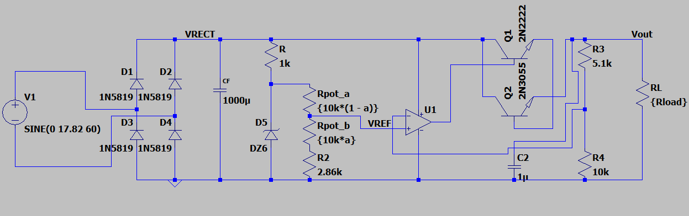
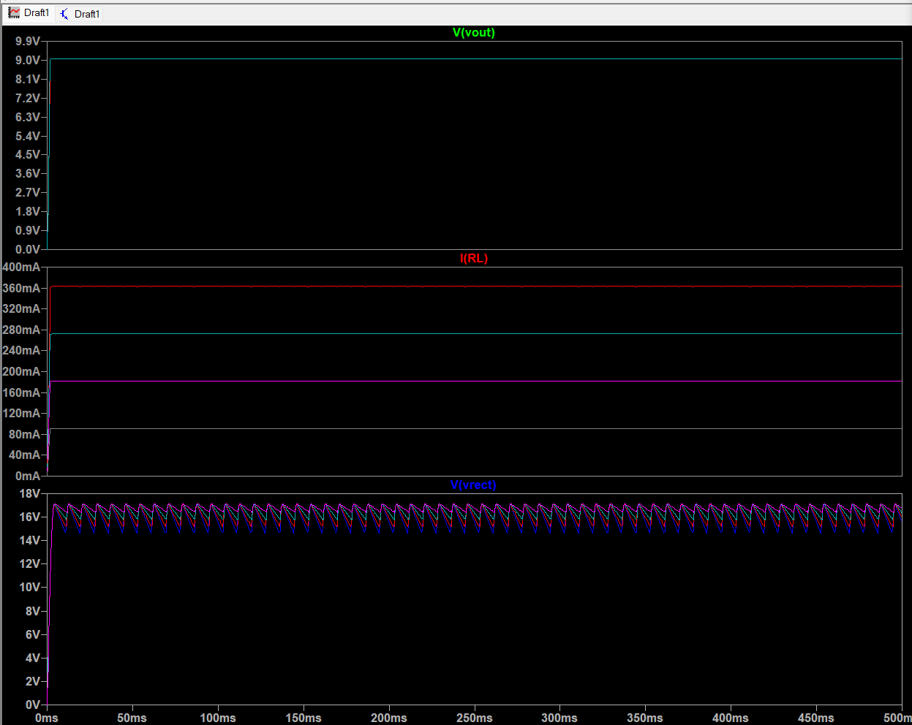
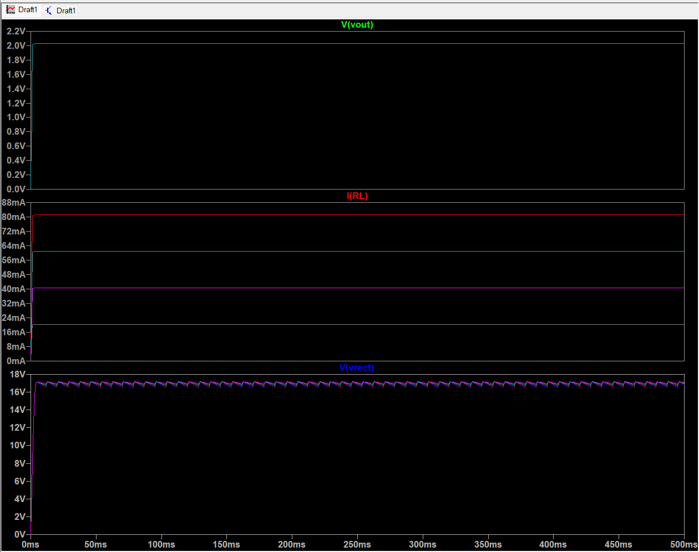
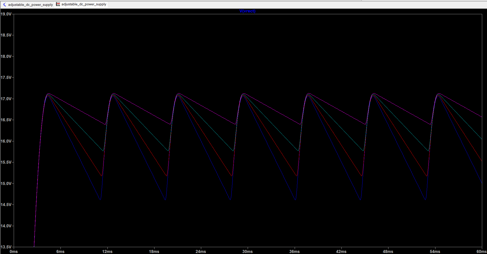

# Adjustable 2–9 V DC Power Supply — LTspice Design & Verification

An adjustable linear DC power supply designed and simulated in LTspice, combining full-wave rectification, capacitive filtering, Zener referencing, closed-loop op-amp regulation, and a BJT pass stage.

The design was verified across multiple load conditions from approximately **90 mA to 363 mA**, while maintaining a regulated output near **9 V** and remaining within the specified rectifier-ripple constraint.

---

## Design Overview

<p align="center">
  
</p>

The power supply consists of five main stages:

**AC Input → Full-Wave Rectifier → Filter Capacitor → Reference & Error Amplifier → BJT Pass Stage → Load**

### 1. Full-Wave Bridge Rectifier
Four diodes rectify the 60 Hz AC source, producing a 120 Hz full-wave rectified waveform.

### 2. Capacitive Filter
A **1000 µF** capacitor stores energy between rectified peaks and reduces the ripple presented to the regulator.

### 3. Zener Reference
A **6 V Zener diode** establishes the reference from which the adjustable control voltage is generated.

### 4. Op-Amp Feedback Regulator
The op-amp compares the adjustable reference voltage against a divided sample of the output voltage.

Any difference between these signals drives the pass stage, forming a closed-loop regulator.

### 5. BJT Pass Stage
The transistor stage supplies the load current while allowing the op-amp to control the output without directly delivering the full load current.

---

## Design Targets

| Parameter | Target |
|---|---:|
| AC source | 12.6 Vrms, 60 Hz |
| Adjustable DC output | ≈ 2–9 V |
| Maximum design load current | 380 mA |
| Maximum allowed rectifier ripple | 3.5 Vpp |
| Filter capacitor | 1000 µF |
| Zener reference | 6 V |

---

## Design Calculations

The 12.6 Vrms transformer secondary corresponds to a peak voltage of:

$$
V_{2(pk)} = \sqrt{2}(12.6) \approx 17.82\text{ V}
$$

Accounting for two conducting diodes in the bridge:

$$
V_{C(max)} \approx 17.82 - 2(0.7)
$$

$$
V_{C(max)} \approx 16.42\text{ V}
$$

Using the specified maximum ripple:

$$
V_{C(min)} = 16.42 - 3.5
$$

$$
V_{C(min)} \approx 12.92\text{ V}
$$

The calculated minimum filter capacitance was approximately:

$$
C_{F(min)} \approx 759\ \mu\text{F}
$$

A standard:

$$
\boxed{C_F = 1000\ \mu\text{F}}
$$

capacitor was selected.

### Feedback Network

For a maximum output near 9 V using the 6 V reference:

$$
V_{OUT} =
\left(1+\frac{R_3}{R_4}\right)V_{REF}
$$

Using:

- \(R_3 = 5.1\text{ k}\Omega\)
- \(R_4 = 10\text{ k}\Omega\)

gives a closed-loop gain of approximately:

$$
1+\frac{5.1}{10}=1.51
$$

resulting in a maximum output near 9 V.

---

## Selected Components

| Component | Value |
|---|---:|
| \(C_F\) | 1000 µF |
| Zener diode | 6 V |
| Series resistor | 1 kΩ |
| Potentiometer | 10 kΩ |
| \(R_2\) | 2.86 kΩ |
| \(R_3\) | 5.1 kΩ |
| \(R_4\) | 10 kΩ |
| \(C_2\) | 1 µF |

---

# Simulation & Verification

Rather than verifying the circuit at a single operating point, the load resistance was swept across:

$$
R_L = 100,\ 50,\ 33.33,\ 25\ \Omega
$$

to evaluate regulation as load current increased.

---

## Maximum-Output Load Regulation

At the maximum voltage setting, LTspice produced the following steady-state results:

| Load | Average Output | Load Current | Output Ripple | Rectifier Ripple |
|---:|---:|---:|---:|---:|
| 100 Ω | 9.081 V | 90.8 mA | 2.77 mVpp | 0.732 Vpp |
| 50 Ω | 9.080 V | 181.6 mA | 5.21 mVpp | 1.332 Vpp |
| 33.33 Ω | 9.079 V | 272.4 mA | 7.69 mVpp | 1.903 Vpp |
| 25 Ω | 9.078 V | 363.1 mA | 10.22 mVpp | 2.447 Vpp |

Across approximately **90.8 mA → 363.1 mA**, the average output changed by only about:

$$
\boxed{3.5\text{ mV}}
$$

while the largest simulated rectifier ripple was:

$$
\boxed{2.45\text{ V}_{pp}}
$$

which remains below the **3.5 Vpp design limit**.

<p align="center">
  
</p>

---

## Minimum-Output Regulation

The potentiometer was also moved to the minimum-output setting.

Measured average output:

| Load | Average Output |
|---:|---:|
| 100 Ω | 2.02845 V |
| 50 Ω | 2.02837 V |
| 33.33 Ω | 2.02831 V |
| 25 Ω | 2.02824 V |

The total simulated output variation across these load conditions was approximately:

$$
\boxed{0.20\text{ mV}}
$$

demonstrating stable closed-loop regulation at the lower end of the adjustment range.

<p align="center">
  
</p>

---

## Rectifier Ripple Under Load

The filtered rectifier voltage was examined independently across the same load sweep.

<p align="center">
  
</p>

As load current increases, the filter capacitor discharges more rapidly between rectified peaks.

The simulation therefore shows the expected relationship:

$$
I_L \uparrow
\quad\Rightarrow\quad
\Delta V_{RECT} \uparrow
$$

The highest measured rectifier ripple occurred at the heaviest tested load:

$$
R_L=25\ \Omega
$$

$$
I_L\approx363\text{ mA}
$$

$$
V_{RECT,ripple}\approx2.45\text{ V}_{pp}
$$

---

# What I Verified

The LTspice model was used to verify:

- Full-wave bridge rectification
- 120 Hz capacitor charging behavior
- Filter-capacitor ripple
- Zener-based voltage referencing
- Adjustable output voltage
- Closed-loop op-amp feedback
- BJT load-current delivery
- Minimum and maximum output operation
- Load regulation across four resistance values
- Output ripple under increasing load
- Rectifier ripple under increasing load

---

# Engineering Takeaways

This project reinforced several design concepts beyond simply obtaining the desired output voltage:

- Component values must be selected from circuit requirements rather than chosen arbitrarily.
- Increasing load current increases capacitor discharge between rectifier peaks and therefore increases ripple.
- Negative feedback allows the regulator to reject much of the variation present on the unregulated DC rail.
- The op-amp can control a higher-current load by driving a transistor pass stage rather than sourcing the load directly.
- Parameter sweeps and automated measurements provide a more useful verification methodology than checking a single operating point.

---

# Tools & Skills

**Simulation**
- LTspice
- Transient analysis
- Parameter sweeps
- Automated `.meas` measurements
- Waveform analysis

**Circuit Design**
- Semiconductor diodes
- Full-wave rectification
- Capacitive filtering
- Zener regulation
- Operational amplifiers
- Negative feedback
- BJT pass stages
- Load regulation
- Ripple analysis

---

# Repository Structure

```text
.
├── images/
│   ├── schematic_ltspice.png
│   ├── load_regulation_9V.png
│   ├── load_regulation_2V.png
│   └── rectifier_ripple.png
│
├── ltspice/
│   └── adjustable_dc_power_supply.asc
│
├── report/
│   └── EE321_Mini_Project_Report.pdf
│
├── LICENSE
└── README.md
